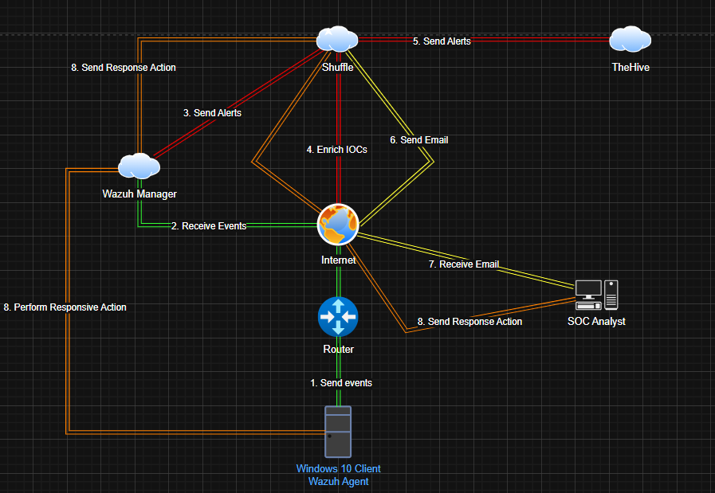

# Wazuh-Lab

# Introduction
The aim of this lab is to familiarise ourselves with Wazuh, The Hive and Shuffler in order to automate Security Operations Centre (SOC) tasks.
First, we will create a diagram to help visualise the data flow between our machines and components in the lab environment.



Explanation:

1. The Windows 10 virtual machine (VM) sends Sysmon logs to the Wazuh server.
2. The Wazuh server sends this information to Shuffle, which runs a VirusTotal scan on the malware before creating a case in TheHive.
3. An email alert is sent to the analyst to notify them of the event, allowing them to investigate and take action.

# Setup

Let's download and configure sysmon on our Windows 10 virtual machine.

> **Sysmon (System Monitor)** is a Windows system service and device driver that logs system activity to the Windows Event Log. It's part of the Microsoft Sysinternals Suite and is widely used for advanced event logging.

We’ll install it and configure it using **Olaf Hartong’s `sysmonconfig.xml`**, a community-trusted configuration.

### Step 1: Download Sysmon

1. Visit the official [Microsoft Sysinternals Sysmon page](https://learn.microsoft.com/en-us/sysinternals/downloads/sysmon)
2. Download **Sysmon for Windows**
3. Extract the zip contents

### Step 2: Download Olaf’s Sysmon Config

1. Visit Olaf’s GitHub repo: [https://github.com/olafhartong/sysmon-modular](https://github.com/olafhartong/sysmon-modular)
2. Download the `sysmonconfig.xml` file to the directory where Sysmon is downloaded.

### Step 3: Install and Configure Sysmon

Open a **Powershell as Administrator** and navigate to the folder where `Sysmon64.exe` and `sysmonconfig.xml` are located.

Then run:

```cmd
.\Sysmon64.exe -i sysmonconfig.xml
```
Once installed, our Sysmon service should be ready to use. We can now ingest the Sysmon logs into our Wazuh server.

# Wazuh Server Setup

> Wazuh is a free, open-source security platform that unifies SIEM (Security Information and Event Management) and XDR (Extended Detection and Response) capabilities. It monitors endpoints, cloud workloads, and containers to detect threats, monitor file integrity, and ensure regulatory compliance. It uses a lightweight agent, a central server, and a dashboard for visualization.

You can use this [official documentation](https://documentation.wazuh.com/current/quickstart.html) to install and configure Wazuh, but for simplicity in this lab, we're going to use a [pre-built virtual machine image](https://documentation.wazuh.com/current/deployment-options/virtual-machine/virtual-machine.html) in Open Virtual Appliance (OVA) format which includes an Amazon Linux 2023 operating system and the Wazuh central components.

Let's navigate to VirtualBox > File > Import Appliance. Then we can select our pre-built, downloaded image, hit Next, and finish setting up our Wazuh server.


Next, we will set up and install TheHive.

# TheHive's Setup

> TheHive is a scalable, open-source, and commercial Security Incident Response Platform (SIRP) designed for SOCs, CERTs, and cybersecurity analysts to investigate, triage, and act upon security incidents collaboratively. It streamlines threat analysis by integrating with MISP (Malware Information Sharing Platform) and automating workflows, significantly reducing incident response time.

To setup TheHive, we're going to use a [Ubuntu 22.04.5 live server](https://releases.ubuntu.com/jammy/) virtual machine and follow [this documentation](https://docs.strangebee.com/thehive/installation/installation-guide-linux-standalone-server/) provided by StrangeBee.

# TheHive's Configuration

As the Hive's configuration is mentioned in the documentation, we won't go into much detail about it here. 
However, we are going to change some variables that were not mentioned in the documentation at the time of writing.

>  ⚠️ Note: Only run the following commands after installing Cassandra, Java and Elasticsearch from the documentation; otherwise, you won't be able to find the configuration files.

## Cassandra

Let's run:

```
nano /etc/cassandra/cassandra.yaml
```
Then change the parameters below:


> Click ```Ctrl+W``` if you want to search for a specific parameter or word.

> To find out your IP address, run the ```ip a``` command then make the necessary changes to the ```listen_address``` , ```rpc_address``` and ```seeds``` fields.

Run: 

```
systemctl stop cassandra.service
rm -rf /var/lib/cassandra/*
systemctl start cassandra.service
```

## ElasticSearch

```
nano /etc/elasticsearch/elasticsearch.yml
```
Change these parameters:


Run:
```
systemctl start elasticsearch
systemctl enable elasticsearch
```

## TheHive
Run: 
```
chown -R thehive:thehive /opt/thp
nano /etc/thehive/application.conf
```


However, once we have configured Cassandra, Java and Elasticsearch, we can check if our services are active by running the following commands:
```
systemctl status thehive
systemctl status cassandra.service
systemctl status elasticsearch.service
```

If all services are up, we can access our server by entering its IP address and port 9000 into our browser's URL.

